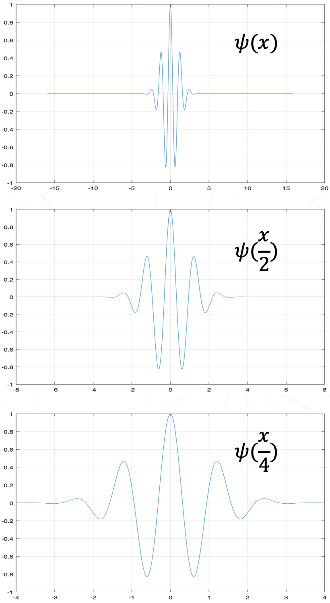
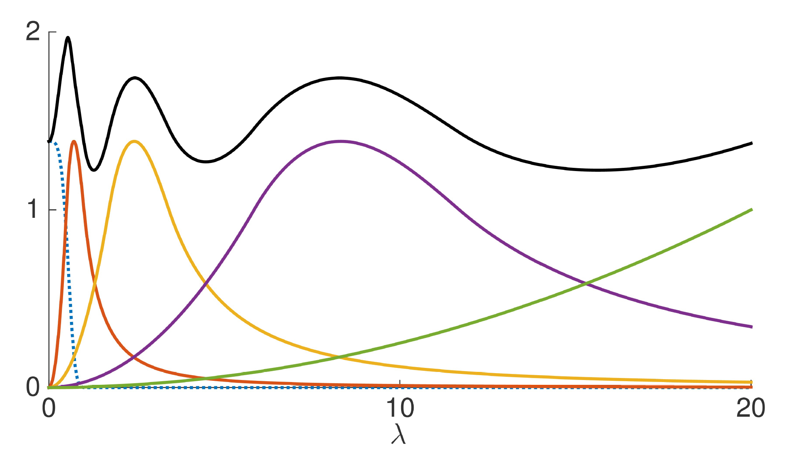
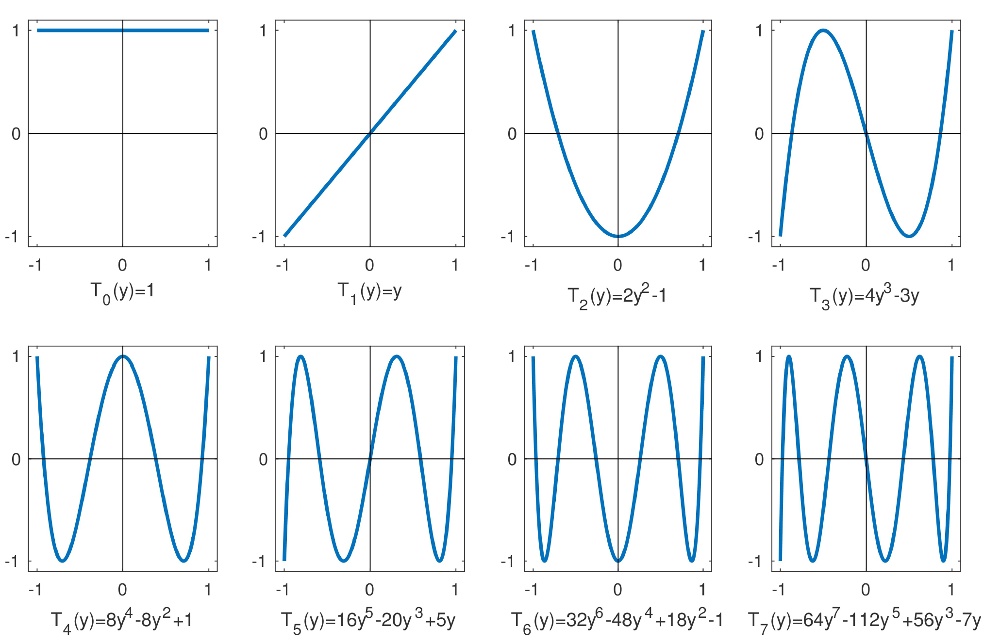
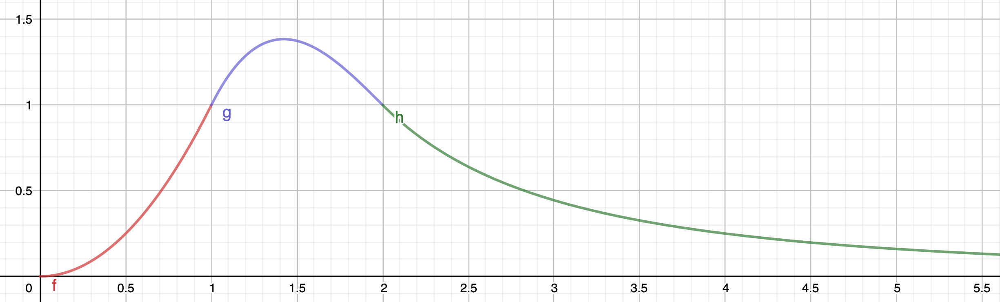
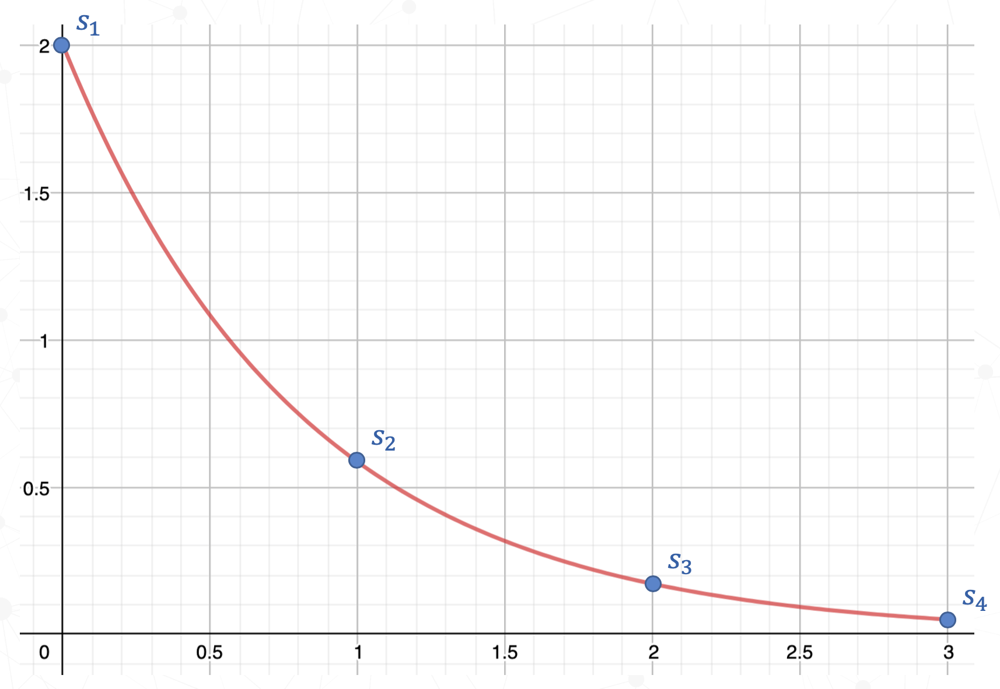
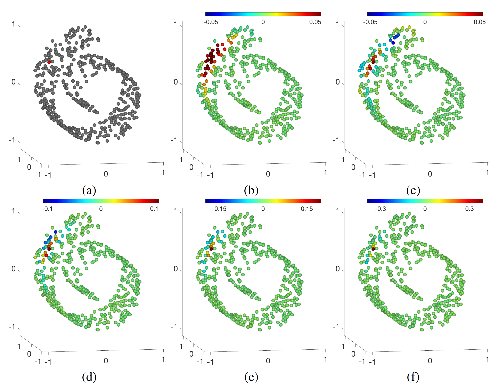
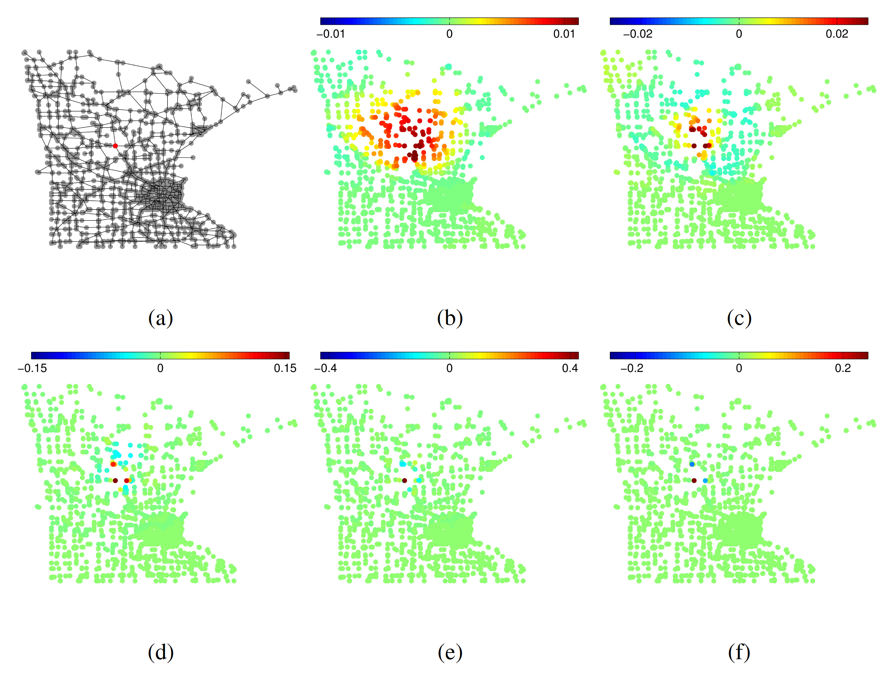
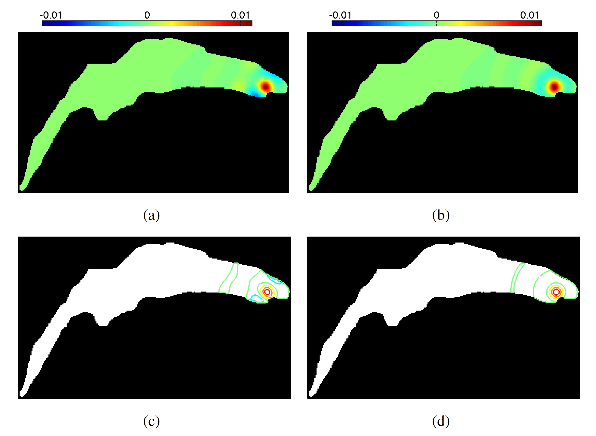

# Spectral Graph Wavelet Transform

> The spectral graph wavelet transform (SGWT) ([Hammond et al., 2011](https://www.sciencedirect.com/science/article/pii/S1063520310000552)) defines the wavelet transform for weighted graphs. The key point of the SGWT is to design a real-valued kernel function $g(\lambda)$ that acts as a bandpass filter in the Fourier domain. With the kernel functions $g(s\lambda)$ at discrete scales $s$, we are able to create wavelets that are not only localized in the graph spectrum, but also localized in the spatial vertex domain.

Wavelet transform has been widely used in many fields such as signal processing, data compression, denoising, etc. Wavelet transform has the property that the wavelets are well localized in both frequency and space domain.

While Fourier transform has been successfully transfer to the graph domain ([Kipf & Welling 2017](https://arxiv.org/abs/1609.02907)), it is also possible to define wavelet transform on graphs. The spectral graph wavelet transform (SGWT) ([Hammond et al., 2011](https://www.sciencedirect.com/science/article/pii/S1063520310000552)) is one of the earliest works that brought the wavelet transform into the spectral graph theory.

The challenges of designing the wavelet transform on graphs are mainly twofold:

* **How to design the mother wavelet in graph domain, and how to define the scaling and translation operations for this mother wavelet on weighted graphs.**

  The mother wavelet is localized in some Euclidean space, however, graphs don't necessarily contains the coordinates information, then how can we design a localized mother wavelet in a non-Euclidean space?

  Another problem is, in the classical wavelet transform, both scaling and translation of the mother wavelet are defined in the space domain, however, for the graph data, it is elusive how to define these two operations directly.

  In the SGWT, the wavelet designing problem and the scaling problem are both solved by a wavelet transform analogue in the frequency domain. It is done by first showing that the scaling of a wavelet in the space domain can be completely transferred to the frequency domain, where a scaled wavelet acts as a bandpass filter (only frequencies in a frequency band are passed). Hence in the SGWT, instead of scaling in the space domain, we scale the mother wavelet in the frequency domain. A real-valued kernel function $g(\lambda)$ is designed to represent the corresponding bandpass filter of the mother wavelet in the frequency domain, hence we no longer need to worry about how to design the mother wavelet in a non-Euclidean space, we just need to make sure that the corresponding wavelets of $g(\lambda)$ in the graph domain are indeed localized. Then for some discrete scale values $s_1,s_2,\dots,s_J$, we could obtain multiple kernel functions $g(s_1\lambda), g(s_2\lambda),\dots,g(s_J\lambda)$ such that each of them will cover a sub-band of the entire graph spectrum.

  Then for the translation problem, a delta impulse function (only have value 1 at one point and 0 everywhere else) was introduced to show that translating a mother wavelet is the same as applying the mother wavelet to a delta impulse.

* **How to make the graph wavelet transform efficient for large graphs.**

  Based on the solution to the scaling problem, a Fourier transform of the graph data is needed, it is done by diagonalizing the graph Laplacian matrix $\mathscr{L}=U\Lambda U^T$ (also termed as the eigendecomposition) to obtain the frequencies of the graph and the corresponding eigenbasis. However, this eigendecomposition is of $O(N^3)$ time complexity. For any graph with more than a few thousands vertices, the SGWT will be too expansive to use.

  Hence, a polynomial approximation approach is used to calculate the transform without the expansive eigendecomposition. It is achieved by directly approximating the kernel function $g(s\lambda)$ by truncated Chebyshev polynomials. The maximum error of the truncated Chebyshev polynomials is only a slightly higher than that of the minimax polynomial (the unique polynomial which has the smallest maximum deviation from the true function), and in the region where $g(s\lambda)$ is smooth, truncated Chebyshev polynomials have significantly lower approximation error.

## Table of Contents
- [Classical Continuous Wavelet transform](#classical-continuous-wavelet-transform)
  * [CWT as a Bandpass Filter](#cwt-as-a-bandpass-filter)
  * [Delta Functions](#delta-functions)
- [Notation for Weighted Graphs](#notation-for-weighted-graphs)
- [Graph Fourier Transform](#graph-fourier-transform)
- [Spectral Graph Wavelet Transform (SGWT)](#spectral-graph-wavelet-transform--sgwt)
- [Scaling Functions](#scaling-functions)
- [Localization of Graph Wavelets](#localization-of-graph-wavelets)
- [Polynomial Approximation](#polynomial-approximation)
  * [Chebyshev Polynomials](#chebyshev-polynomials)
  * [Chebyshev Approximation](#chebyshev-approximation)
  * [Fast Computation of SGWT](#fast-computation-of-sgwt)
- [Inverse Graph Wavelet transform](#inverse-graph-wavelet-transform)
- [SGWT Design Details](#sgwt-design-details)
  * [Kernel Design](#kernel-design)
  * [Scale Selection](#scale-selection)
- [Examples](#examples)
  * [Swiss Roll](#swiss-roll)
  * [Minnesota Road Network](#minnesota-road-network)
  * [Regular Grid of Lake Geneva](#regular-grid-of-lake-geneva)
- [Appendix](#appendix)
  * [Frame Bound](#frame-bound)
  * [Minimum Norm Solution](#minimum-norm-solution)
- [References](#references)

<small><em><a href='http://ecotrust-canada.github.io/markdown-toc/'>Table of contents generated with markdown-toc</a></em></small>

## Classical Continuous Wavelet transform
The classical continuous wavelet transform (CWT) is construct from the **mother wavelet function $\psi(x)$**, which is a wave-like function that will burst for a short time and then quickly die away. To generate a continuous family of wavelets, we simply scale and translate the mother wavelet by a continuous scaling factor $s>0$ and a continuous translation factor $a$:

$$\psi_{s,a}(x)=\frac{1}{s}\psi(\frac{x-a}{s})$$

Note that the $\frac{1}{s}$ is the $L1$ normalization. A more common selection will be the $L2$ normalization ($\frac{1}{\sqrt{s}}$), the reason that $L1$ normalization is used in SGWT is because $L1$ normalization will make the wavelets at different scales all have the same amplitude in the frequency domain.

Then for given a signal $f(x)$, the **wavelet coefficients** are obtained by taken the inner product of each of these wavelet $\psi_{s,a}$ with the signal $f$:

$$W_f(s,a)=\langle \psi_{s,a}, f \rangle=\int_{-\infty}^{\infty}\frac{1}{s}\psi^*(\frac{x-a}{s})f(x)dx$$

We could think of the wavelet coefficient $W_f(s,a)$ at scale $s$ and translation $a$ being how much of $\psi_{s}$ exists in $f$ around $a$, with a continuous translation parameter $a$, we evaluate this amount of $\psi_{s}$ everywhere along $f$ with a fine step, and with a continuous scaling parameter $s$, we repeat this evaluation using a gradually changing wavelet $\psi_{s}$.

This process is invertible, i.e., $f(x)$ can be reconstructed using all the wavelet coefficients $W_f(s,a)$ at different scales and locations), provide that the mother wavelet $\psi(x)$ satisfies the **admissibility condition**:

$$\int_0^{\infty}\frac{|\hat{\psi}(\omega)|^2}{\omega}d\omega=C_\psi<\infty$$

Where $\hat{\psi}(\omega)$ being the Fourier transform of the mother wavelet $f(x)$. If this admissibility condition is satisfied, then we can invert the CWT:

$$f(x)=\frac{1}{C_\psi}\int_0^{\infty}\int_{-\infty}^{\infty}W_f(s,a)\psi_{s,a}(x)\frac{dads}{s}$$

So far, we are assuming that $f(x)$ is a signal on the real line, now we want to apply this classical CWT to graph data.

**The first challenge will be how to design a mother wavelet that is localized in the graph domain** as it is localized in space domain for the classical CWT, i.e., the graph wavelets should span around a center vertex in the graph with respect to some kind of distance measurement. Noted that this distance measurement should not depends on any kind of Euclidean distance since graph data normally don't have any Euclidean structure encoded. A naturally choice could be the shortest path between two vertices.

**The second challenge is how to define the scaling and translation operations for this mother wavelet on weighted graphs**. Assume that we are able to design a mother wavelet that is localized on a graph with respect to the shortest path distance measurement, then the scaling could be done by expanding/shrinking the radius of the mother wavelet, and the translation could be achieved by shifting the wavelet center to each vertex in the graph.

The SGWT did not approach to these two challenges directly, instead, they design the mother wavelet in the frequency domain, and shown that scaling could be also done in the frequency domain. As for the translation operation, a delta impulse function (only have value 1 at one point and 0 everywhere else) was introduced to show that, translating a mother wavelet is the same as applying the mother wavelet to a delta impulse, this is useful because we can easily design a delta function on graphs, which simply is a vector that only only have value 1 at certain vertex and 0 elsewhere.

Next we will first look at that, for the classical CWT, how can we transfer the scaling operation from the space domain to the frequency domain, and utilize delta impulse to achieved the translation of mother wavelet. Then in the following sections, after we got familiar with the notations of graph and the graph Fourier transform, we can discuss how to design the scaling and translation analogues on graphs.

### CWT as a Bandpass Filter
We already know that the CWT computes the inner product of a scaled and translated mother wavelet $\psi_{s,a}(x)=\frac{1}{s}\psi(\frac{x-a}{s})$ with a signal $f(x)$:

$$CWT=\langle \psi_{s,a}, f \rangle=\int_{-\infty}^{\infty}\frac{1}{s}\psi^*(\frac{x-a}{s})f(x)dx$$

We can also interpret the CWT as a frequency-based filtering of the signal by rewriting the CWT as an inverse Fourier transform:

$$CWT=\frac{1}{2\pi}\int_{-\infty}^{\infty}\bar{\hat{\psi}}(s\omega)\hat{f}(\omega)e^{i\omega a}d\omega$$

where $\hat{\psi}(\omega)$ and $\hat{f}(\omega)$ are the Fourier transforms of the wavelet and the signal.

From these two equations, we could see that scaling a wavelet by $\frac{1}{s}$ in the space domain is the as scaling a wavelet by $s$ in the frequency domain. The following two figures demonstrate the scaling effect in space and frequency domain respectively, for scale values $s=\\\{1,2,4\\\}$.

<em>Fig. 1. Scaling a wavelet in space domain with scale values 1,2 and 4.</em>

<em>Fig. 2. Scaling a wavelet in frequency domain with scale values 1,2 and 4. (Image source:<a href="https://www.mathworks.com/help/wavelet/gs/continuous-wavelet-transform-as-a-bandpass-filter.html">MathWorks</a>)</em>

In the above figure, $\omega$ corresponds to the frequency, $\hat{\psi}(\omega)$ is the Fourier transform of the wavelet function $\psi$, the amplitude of $\hat{\psi}(\omega)$ shows how much the wavelet contains certain frequency components, it is centered at $\omega_0$, which termed as the **center frequency**, it is the main frequency component of wavelet $\psi$. The support (none-zero part) of $\hat{\psi}(\omega)$ is the frequency band the wavelet contains (wavelet spectrum), when we do the wavelet transform, we multiple this $\hat{\psi}(\omega)$ with the frequencies of the signal ($\hat{f}$), only the frequency components within the support of the wavelet will remain, that is why CWT can act as a **bandpass filter** (only frequencies in a frequency band are passed).

Also in this figure, from the top to the bottom are three wavelets with different scales (1, 2, 4 respectively), we see that the center frequency has changed along with the scale. Bigger the scale, lower the center frequency ($\omega/s$). CWT coefficients at lower scales represent energy in the input signal at higher frequencies, while CWT coefficients at higher scales represent energy in the input signal at lower frequencies. Noticed that, the width of the bandpass filter also changed, it is inversely proportional to scale. The width of the CWT filters decreases with increasing scale. This follows from the uncertainty relationships between the time and frequency support of a signal: the broader the support of a signal in time, the narrower its support in frequency. The converse relationship also holds.

### Delta Functions

<em>Fig. 3. The delta function. (Image source:<a href="https://www.wikiwand.com/en/Dirac_delta_function#:~:text=As%20a%20distribution%2C%20the%20Dirac,of%20the%20Dirac%20delta%20function.">Wikipedia</a>)</em>

The **delta function $\delta(x)$**, also called the **Dirac delta function** or the **unit impulse symbol** in engineering and signal processing, is drawn as a singular arrow at one point to indicate an infinitely tall spike (an impulse). The y-axis value 1 represent its density ($\int_{-\infty}^{\infty}\delta(x)dx=1$), not height.

The delta function has an important property: **Convolution of a function $f(x)$ with a shifted delta function $\delta(x-a)$ yields a shifted version of that function of the same amount $f(x-a)$:**

$$f(x)\star\delta(x-a)=f(x-a)$$

Using this property, translating the mother wavelet by a factor $a$ is the same as convoluting the mother wavelet with a shifted delta function $\delta(x-a)$:

Let

$$\psi_{s}(x)=\frac{1}{s}\psi(\frac{x}{s})$$

then

$$\psi_{s}(x) \star \delta(x-a)=\psi_{s}(x-a)=\frac{1}{s}\psi(\frac{x-a}{s})=\psi_{s,a}(x)$$

Later, this result will be used to define the translation operation on graphs.

## Notation for Weighted Graphs
A **weighted graph $G = \\\{E, V, w\\\}$** consists of:

* a set of vertices $V$, where $\|V\| = N < \infty$.
* a set of edges $E$.
* a weight function $w: E\rightarrow\mathbb{R}^+$ which assigns a positive weight to each edge.

The **adjacency matrix $A$** for a weighted graph $G$ is the $N \times N$ matrix where

$$
A_{m,n} = \left
\{
\begin{array}{ll}
w(e), & \mbox{if $e\in E$ connects vertices $m$ and $n$} \\
0, & \mbox{otherwise} \\
\end{array}\right.
$$

The **degree matrix $D$** is a $N \times N$ diagonal matrix where

$$
D_{m,n} = \left
\{
\begin{array}{ll}
d(m)=\sum_nA_{m,n}, & \mbox{if $m=n$} \\
0, & \mbox{otherwise} \\
\end{array}\right.
$$

The **Laplacian matrix $\mathscr{L}$**, also called the graph Laplacian, is a matrix representation of a graph, many useful properties of a graph can be extract using the graph Laplacian. It is defined as

$$\mathscr{L}=D-A$$

Noticed that:

* $\mathscr{L}$ is symmetric.
* $\mathscr{L}$ is positive-semidefinite (that is all its eigenvalues are non-negative).

## Graph Fourier Transform
The graph Fourier transform is based on the **eigendecomposition of the graph Laplacian**:

$$\mathscr{L}=U\Lambda U^T$$

where $\Lambda=diag([\lambda_0,\dots,\lambda_{N-1}])\in\mathbb{R}^{N \times N}$ is a diagonal matrix that contains all the **eigenvalues** of $\mathscr{L}$, we could think of these eigenvalues as the frequencies of the graph.

and $U=[u_0,\dots,u_{N-1}]\in\mathbb{R}^{N \times N}$ are the corresponding **eigenvectors** ($\mathscr{L}u_i=\lambda_iu_i$), it is an orthonormal basis, which means:

$$
\langle u_i,u_j \rangle = \left
\{
\begin{array}{ll}
1, & \mbox{if $i=j$} \\
0, & \mbox{otherwise} \\
\end{array}\right.
$$

Then the **graph Fourier transform** for a signal $f\in\mathbb{R}^N$ on graph (a scalar for each vertex) will be:

$$\hat{f}=U^Tf\in\mathbb{R}^N$$

We could think of the $\hat{f}$ as the frequency constitution of $f$, each value $\hat{f}_i$ represent how much frequency $\lambda_i$ represent in signal $f$:

$$\hat{f}_i=\langle u_i,f \rangle \in\mathbb{R}$$

The **inverse graph Fourier transform** is simply by doing:

$$f=U\hat{f}$$

## Spectral Graph Wavelet Transform (SGWT)
So far, we know that we could rewrite the CWT as an inverse Fourier transform, interpret CWT as a bandpass filtering in the frequency domain:

$$CWT=\frac{1}{2\pi}\int_{-\infty}^{\infty}e^{i\omega a}\bar{\hat{\psi}}(s\omega)\hat{f}(\omega)d\omega$$

by doing this, we also transfer the scaling operation from the space domain to the frequency domain.

In other words, the CWT at scale $s$ and translation $a$ can be done by:

* first taking the Fourier transform of the signal to obtain its Fourier coefficients $\hat{f}(\omega)$
* then, do the bandpass filtering using $\bar{\hat{\psi}}(s\omega)$ in the frequency domain
* finally, we do an inverse Fourier transform using $e^{i\omega a}$ to obtain the CWT coefficients.

Following this process, we can design the **SGWT** as:

$$SGWT=Ug(s\Lambda)U^Tf$$

where:

* $\hat{f}=U^Tf$ is the Fourier transform of the signal
* $g(\lambda)$ is a bandpass filter directly design in the graph spectrum, a scaled filter $g(s\lambda)$ at scale $s$ is then used to do the spectral filtering
* at last, we do an inverse graph Fourier transform using $U$ to obtain the final graph wavelet transform coefficients

We have learned that translation of a wavelet can be achieved by applying it to a delta function.

$$\psi_{s,a}(x)=\psi_{s}(x) \star \delta(x-a)$$

Then for SGWT, the graph wavelet at scale $s$ is $\psi_s=Ug(s\Lambda)U^T$, translating this graph wavelet to centered on vertex $n$ is similar as applying $\psi_s$ to a delta function $\delta_n\in\mathbb{R}^N$ which only has value $1$ at on vertex $n$ and zeros elsewhere:

$$\psi_{s,n}=\psi_s\delta_n=Ug(s\Lambda)U^T\delta_n$$

which essentially is the $n$-th column of $\psi_s$. Then the wavelet coefficients at scale $s$ and centered on vertex $n$ can be obtained along by:

$$W_f(s,n)=\langle \psi_{s,n},f \rangle$$

## Scaling Functions
Recalled that, when we double the scale value $s$, the center frequency of the wavelet is halved (moving towards the lower frequencies), its support in the frequency domain also halved, hence, to cover the entire low frequency band, we need to keep increasing the scale value to an infinite large number. This is obviously impractical, a common solution to this problem is to use a **scaling function** that acts as a lowpass filter to cover the low frequency band.

<em>Fig. 4. A scaling function that covers the low frequency band. (Image source:<a href="http://www.polyvalens.com/blog/wavelets/theory/.">PolyValens</a>)</em>

Scaling functions are particularly useful when the scale value is not allowed to become arbitrarily large to recover the low frequency components of the signal. In the SGWT, the scaling function is defined similar to the graph wavelets $\phi=Uh(\Lambda)U^T$, using a non-negative kernel $h(\lambda)$ which essentially is a lowpass filter. $h(\lambda)$ satisfies that $h(0)>0$ and $\lim_{\lambda\rightarrow\infty}h(\lambda)=0$. The used of the scaling function ensure stable recovery of the original signal $f$ when the scale value is sampled at a discrete manner.

<em>Fig. 5. Scaling function $h(\lambda)$ (dotted blue curve), wavelet generating kernels $g(s_j\lambda)$, where $s_1 = 2.0$ (red), $s_2 = 0.5848$ (yellow), $s_3 = 0.171$ (purple), $s_4 = 0.05$ (green). The black curve is the sum of squares of the scaling function and all the kernels. (Image source:<a href="https://hal.inria.fr/hal-01943589/document.">Hammond et al., 2019</a>)</em>

The entire set of scaling coefficients are obtained by:

$$\phi f=Uh(\Lambda)U^Tf$$

The scaling function that centered on vertex $n$ is given by $\phi_n=\phi\delta_n$, then the scaling coefficients centered on vertex $n$ can be obtained along by:

$$S_f(n)=\langle \psi_{s,n},f \rangle$$

## Localization of Graph Wavelets
The main advantage of the wavelet transform over the Fourier transform is that the wavelets can be well localized in both frequency and space domain.

Similarly, in SGWT the graph wavelets can be localized in frequency domain if we design their wavelet kernel $g(\lambda)$ as a bandpass filter. However, we have not discussed how to make the graph wavelets localized in space domain.

On graphs, the localization property of a normalized graph wavelet $$\frac{\psi_{s,n}}{\|\psi_{s,n}\|}$$ can be interpret as that:

**when $s$ is small (corresponding to high frequency information), $$\frac{\psi_{s,n}}{\|\psi_{s,n}\|}$$ will approach $0$ for vertices that are far away from the center vertex $n$.**

If this is true, then for some small scale $s$, when we plot the normalized wavelet $$\frac{\psi_{s,n}}{\|\psi_{s,n}\|}$$ on graph, its value will gradually decay from the center vertex $n$ to its connected vertices, which is said to be localized around vertex $n$.

In [Hammond et al., 2019](https://hal.inria.fr/hal-01943589/document), the localization property of the graph wavelets is proved by:

* **Lemma 2**: If two kernel function $g$ and $\widetilde{g}$ are close to each other, then their resulting wavelets $\psi_{s,n}$ and $$\widetilde{\psi}_{s,n}$$ should also be close to each other. This is the necessary justification if we want to prove the localization property of $\psi_{s,n}$ by proving $$\widetilde{\psi}_{s,n}$$ is localized. (An error bound $M(s)$ is used in Lemma 2: $$\|g(s\lambda)-\widetilde{g}(s\lambda)\| \leq M(t)$$, this error bound is proved in Lemma 4 $M(s) \leq s^{K+1}\frac{\lambda_{N-1}^{K+1}}{(K+1)!}B$.)

* **Lemma 3**: The powers of graph Laplacian $\mathscr{L}^k$ are localized on graphs. Then for wavelets $\psi_{s,n}$ that can be approximated by some powers of graph Laplacian $\mathscr{L}^k$, $\psi_{s,n}$ will also be localized on graphs.

* **Lemma 4**: The approximation error of $\psi_{s,n}$ using $\mathscr{L}^k$ is only proved for some specific kernel $g$. That is:
kernel $g$ should satisfies $g(0)=0$ and is sufficient smooth around 0 ($g^{(r)}(0)=0$ for all $r<K$), then we can approximate the scaled kernel $g(s\lambda)$ by $\widetilde{g}(s\lambda)$, which is a Taylor expansion of $g(s\lambda)$. Since $g^{(r)}(0)=0$ for all $r<K$, so only the last term in this expansion is nonzero, and it is a power of $s\lambda$, finally, its corresponding wavelet can be expressed as a power of $\mathscr{L}$ which is localized on graph. Additionally, it is proved that for this kind of kernels, the approximation error $M(s)=\underset{\lambda\in[0,\lambda_{N-1}]}{sup}|g(s\lambda)-\widetilde{g}(s\lambda)| \leq s^{K+1}\frac{\lambda_{N-1}^{K+1}}{(K+1)!}B$ is indeed bounded.

* **Theorem 2**: With all the previous Lemmas, here the localization property of $$\frac{\psi_{s,n}}{\|\psi_{s,n}\|}$$ is proved, such that if $s\rightarrow 0$, then for vertices that are far away from the center vertex $n$, this normalized graph wavelet will decay to zero.

If you are interested in more details about how these Lemmas and Theorem are proved, it is welcome to refer to my fully annotated version of this paper [Wavelets on graphs via spectral graph theory](https://www.overleaf.com/read/sgpjrkfvjzwv).

## Polynomial Approximation
We now have the idea of what SGWT is, it is simply a scaling function in addition to several graph wavelets with different scale values that each covers a sub-band of the graph spectrum in the frequency domain. However, one problem to the current SGWT design is that, it requires the eigendecomposition of the graph Laplacian $\mathscr{L}=U\Lambda U^T$ to obtain the eigenbasis $U$ and all the eigenvalues $\Lambda$. The eigendecomposition is a very expansive process which is of $O(N^3)$ time complexity, for any graph that has more a few thousands of vertices, current SGWT will be infeasible to apply.

Hence, we need a way to simplify the process or avoid using the eigendecomposition. [Hammond et al., 2011](https://www.sciencedirect.com/science/article/pii/S1063520310000552) proposed a polynomial approximation technique that approximate the kernel functions $h(\lambda)$ and $g(s\lambda)$ using truncated Chebyshev polynomials, the advantages of using this Chebyshev approximation are:

* Avoid the expansive eigendecomposition
* Fast computation that only relies on the repeated matrix-vector multiplication of $\mathscr{L}$ and $f$
* Even more efficient when the graph is sparse (which is true in most cases)

Now lets take a look at how exactly this Chebyshev approximation is carried out.

### Chebyshev Polynomials
The Chebyshev polynomials $T_n(y)$ are a sequences of polynomials that defined from the multiple angle formula of cosine.

$$\cos(n\theta)=T_n(\cos(\theta))$$

Let $y=\cos(\theta)$, the Chebyshev polynomials can be computed using its recurrence relation:

$$T_{n+1}=2yT_n(y)-T_{n-1}(y)$$

<em>Fig. 6. Graphs of the Chebyshev polynomials $T_k(y)$ for $0 \leq k \leq 7$, plotted on the interval $[-1,1]$. (Image source:<a href="https://hal.inria.fr/hal-01943589/document.">Hammond et al., 2019</a>)</em>

The Chebyshev polynomials are orthogonal to each other on interval $[-1,1]$ with respect to the weight function $w(y)=\frac{1}{\sqrt{1-y^2}}$:

$$
\langle T_n(y),T_m(y) \rangle=
\int_{-1}^{1}\frac{T_n(y)T_m(y)}{\sqrt{1-y^2}}dy=\left
    \{
    \begin{array}{ll}
        \|T_0(y)\|=\pi & \mbox{if $m=n=0$} \\
        \|T_n(y)\|=\pi/2 & \mbox{if $m=n \geq 1$}\\
        0 & \mbox{if $m\neq n \geq 1$}
    \end{array}
    \right.
$$

### Chebyshev Approximation
Polynomial approximation is about how to represent functions using polynomials, and Chebyshev approximation is the kind of polynomial approximate that replacing $x^k$ with $T_k(x)$.

For a function $f(x)$ define on $[-1,1]$, we can approximate it using infinite number of Chebyshev polynomials:

$$f(x) \approx \sum_{n=0}^{\infty} c_k T_k(x)$$

Where $c_k$ are the Chebyshev coefficients, which is given by:

$$c_k=\frac{2}{\pi} \langle T_k(x),f(x) \rangle=\frac{2}{\pi}\int_{-1}^{1}\frac{T_k(x)f(x)}{\sqrt{1-x^2}}dx
=\frac{2}{\pi}\int_0^\pi{\cos(k\theta)f(\cos(\theta))d\theta}$$

### Fast Computation of SGWT
Noted that the Chebyshev polynomials are define on $[-1,1]$, in order to approximate the kernel functions $h(\lambda)$ and $g(s\lambda)$ that have $\lambda\geq 0$, we need to transform the Chebyshev polynomial domain from $[-1,1]$ to $[0,\lambda_{max}]$, where $\lambda_{max}$ is the maximum eigenvalue of $\mathscr{L}$. This can be achieved by changing the variable $x=\lambda_{max}(y+1)/2$, if we denote $\overline{T}_k(x)$ as the shifted Chebyshev polynomial, then:

$$\overline{T}_k(x)=T_k(\frac{2x-\lambda_{max}}{\lambda_{max}})$$

Then for each scale value $s_j$, we could use a truncated Chebyshev polynomial $p_j(x)$ (up to order $M$) to approximate the kernel function $g(s_jx)$:

$$g(s_jx)\approx p_j(x)=\frac{1}{2}c_{j,0}+\sum_{k=1}^M{c_{j,k}\overline{T}_k(x)}$$

valid for $x \in [0,\lambda_{max}]$, with the Chebyshev coefficients computed by:

$$c_{j,k}=\frac{2}{\pi}\int_0^\pi {\cos(k\theta)g(s_j\frac{\lambda_{max}}{2}(\cos(\theta)+1))d\theta}$$

The approximated graph wavelets at scale $s_j$ will be:

$$\psi_{s_j}=Ug(s_j\Lambda)U^T\approx Up_j(\Lambda)U^T=p_j(U\Lambda U^T)=p_j(\mathscr{L})$$

Note that in here, $Up_j(\Lambda)U^T=p_j(U\Lambda U^T)$ due to $U^TU=I$ so that:

$$U\Lambda^kU=(U\Lambda U^T)^k=\mathscr{L}^k$$

That is, by using the Chebyshev approximation, we can obtain the graph wavelets through the powers of graph Laplacian $\mathscr{L}^k$, hence, eigendecomposition avoided.

The computation of Chebyshev coefficients $c_{j,k}$ at scale $s_j$ only requires the maximum eigenvalue $\lambda_{max}$ (only a rough estimate is needed) and the wavelet kernel $g(\lambda)$ (a bandpass filter that designed by us), so they can be computed before we know anything about the graph signal $f$.

Once the Chebyshev coefficients $c_{j,k}$ are computed, the corresponding SGWT wavelet coefficients at scale $s_j$ are obtained by:

$$\widetilde{W}_f(s_j)=\langle p_j(\mathscr{L}),f \rangle=\frac{1}{2}c_{j,0}f+\sum_{k=1}^{M}c_{j,k}\overline{T}_k(\mathscr{L})f$$

Similarly, we could approximate the scaling function $\phi=Uh(\Lambda)U^T$ using a truncated Chebyshev polynomial $p_0(\mathscr{L})$ (up to order $M$), then the scaling function coefficients are given by:

$$\widetilde{S}_f=\langle p_0(\mathscr{L}),f \rangle=\frac{1}{2}c_{0,0}f+\sum_{k=1}^{M}c_{0,k}\overline{T}_k(\mathscr{L})f$$

However, the calculation of $$\overline{T}_k(\mathscr{L})$$ requires to compute powers of graph Laplacian up to $\mathscr{L}^k$, even though we only need to compute them once, it still very slow. [Hammond et al., 2011](https://www.sciencedirect.com/science/article/pii/S1063520310000552) argued that, instead of computing the matrix power of $\mathscr{L}^k$ in the $$\overline{T}_k(\mathscr{L})$$ explicitly, we could compute vectors $$\overline{T}_k(\mathscr{L})f$$ ($k={1,\dots,M}$) directly. This is due to the use of the recurrence relation of the Chebyshev polynomial, to compute the vector $$\overline{T}_k(\mathscr{L})f$$, we only need its previous two terms $$\overline{T}_{k-1}(\mathscr{L})f$$ and $$\overline{T}_{k-2}(\mathscr{L})f$$:

$$\overline{T}_k(\mathscr{L})f=\frac{4}{\lambda_{max}}(\mathscr{L}-I)(\overline{T}_{k-1}(\mathscr{L})f)-\overline{T}_{k-2}(\mathscr{L})f$$

Hence we could compute all $$\overline{T}_k(\mathscr{L})f$$ starting from $k=2$ using this recurrence relation. The above computation is dominated by the matrix ($\mathscr{L}-I$) vector ($$\overline{T}_{k-1}(\mathscr{L})f$$) multiplication, hence is much faster than computing the matrix powers of $\mathscr{L}^k$ in the $$\overline{T}_k(\mathscr{L})$$ explicitly.

## Inverse Graph Wavelet transform
From the [Classical Continuous Wavelet transform](#classical-continuous-wavelet-transform) section, we know that if the mother wavelet $\psi(x)$ satisfies the admissibility condition:

$$\int_0^{\infty}\frac{|\hat{\psi}(\omega)|^2}{\omega}d\omega=C_\psi<\infty$$

Then we can invert the CWT to reconstruct input signal $f(x)$:

$$f(x)=\frac{1}{C_\psi}\int_0^{\infty}\int_{-\infty}^{\infty}W_f(s,a)\psi_{s,a}(x)\frac{dads}{s}$$

However, since we are only able to compute the SGWT at some discrete scale values, this inverse transform is not applicable to SGWT, we need to find some other ways to reconstruct the input signal.

In the discrete situation, one such reconstruction method is to find the inverse matrix $W^{-1}$ of the forward transform matrix $W$ (squared) such that:

$$W^{-1}Wf=If=f$$

If $W$ is not a square matrix, then the pseudoinverse will be the natural choice which is given by:

$$W^+=(W^*W)^{-1}W^*$$

here, $W^*$ represents the conjugate transpose (or Hermitian transpose) of $W$, the pseudoinverse $W^+$ is a left inverse of $W$ ($W^*$ and $W^+$ are totally different). In [Hammond et al., 2011](https://www.sciencedirect.com/science/article/pii/S1063520310000552), the minimum-norm property of the pesudoinverse is introduced, however, it has little to do with the reconstruction process, see [Appendix](#minimum-norm-solution) for more detail.

The pseudoinverse $W^+$ only satisfies $W^+W=I$ (i.e., is a left inverse of  $W$) when columns of $W$ are linearly independent (proved in [Appendix](#frame-bound)).

So the question now become how to define the forward transform of SGWT as a matrix. The answer is actually very simple, we just stack the scaling function $\phi$ and all the graph wavelets $\psi_{s_j}$ at scales $s_1,\dots,s_J$ together to form a giant matrix $W$ that contains all the forward SGWT transform parameters:

$$
    \boldsymbol{W} =\left[
        \begin{array}{c}
             \phi_1^T\\
             \vdots\\
             \phi_N^T\\
             \psi_{s_1,1}^T\\
             \vdots\\
             \psi_{s_1,N}^T\\
             \vdots\\
             \vdots\\
             \psi_{s_J,1}^T\\
             \vdots\\
             \psi_{s_J,N}^T\\
        \end{array}
     \right]
     =\left[
        \begin{array}{ccc}
             \phi_1(1) & \cdots & \phi_1(N)\\
             \vdots &  & \vdots\\
             \phi_N(1) & \cdots & \phi_N(N)\\
             \psi_{s_1,1}(1) & \cdots & \psi_{s_1,1}(N)\\
             \vdots &  & \vdots\\
             \psi_{s_1,N}(1) & \cdots & \psi_{s_1,N}(N)\\
             \vdots &  & \vdots\\
             \vdots &  & \vdots\\
             \psi_{s_J,1}(1) & \cdots & \psi_{s_J,1}(N)\\
             \vdots &  & \vdots\\
             \psi_{s_J,N}(1) & \cdots & \psi_{s_J,N}(N)\\
        \end{array}
     \right]
     \in \mathbb{R}^{N(J+1)\times N}
$$

Since we have approximated the $\phi\approx p_0(\mathscr{L})$ and $\psi_{s_j}\approx p_j(\mathscr{L})$ using Chebyshev approximation, so the actual forward transform matrix would be:

$$
    \boldsymbol{\widetilde{W}} =\left[
        \begin{array}{c}
             p_0^T(\mathscr{L})\\
             p_1^T(\mathscr{L})\\
             \vdots\\
             p_J^T(\mathscr{L})\\
        \end{array}
     \right]
     \in \mathbb{R}^{N(J+1)\times N}
$$

and the pseudoinverse of $\widetilde{W}$ is given by:

$$\widetilde{W}^+=(\widetilde{W}^*\widetilde{W})^{-1}\widetilde{W}^*$$

## SGWT Design Details

### Kernel Design
The SGWT kernel $g(\lambda)$ is a bandpass filter, it should satisfies:

* $g(0)=0$
* $\lim_{\lambda\rightarrow\infty}g(\lambda)=0$

In addition to these, in order to ensure the spatial localization of the graph wavelets, the kernel $g(\lambda)$ should also behaves as a monic power of $\lambda$ near the origin (see section [Localization of Graph Wavelets](#localization-of-graph-wavelets)).

[Hammond et al., 2011](https://www.sciencedirect.com/science/article/pii/S1063520310000552) designed a kernel function $g(x)$ that is exactly a monic power near $0$, and will decay to 0 for large $\lambda$, in between, the kernel function is set to be a cubic spline that ensuring continuity of $g$ and $g^{'}$:

$$
g(x;\alpha,\beta,x_1,x_2)=\left
    \{
    \begin{array}{ll}
        x_1^{-\alpha}x^\alpha & \mbox{for $x<x_1$} \\
        s(x) & \mbox{for $x_1 \leq x \leq x_2$} \\
        x_2^{\beta}x^{-\beta} & \mbox{for $x>x_2$}
    \end{array}\right.
$$

One specific choice of $g(x)$ could be:

$$
g(x;\alpha=2,\beta=2,x_1=1,x_2=2)=\left
    \{
    \begin{array}{ll}
        x^2 & \mbox{for $x<1$} \\
        s(x)=-5+11x-6x^2 + x^3 & \mbox{for $1 \leq x \leq 2$} \\
        \frac{4}{x^2} & \mbox{for $x>2$}
    \end{array}\right.
$$

which looks like:

<em>Fig. 7. Wavelet kernel $g(x;\alpha=2,\beta=2,x_1=1,x_2=2)$.</em>

For the scaling function kernel we take $h(x) = \gamma exp(-(\frac{x}{0.6\lambda_{min}})^4)$, where $\gamma$ is set such that $h(0)$ has the same value as the maximum value of $g(x)$, the $\lambda_{min}$ will be defined later.

### Scale Selection
In order to place the wavelets of different scales evenly in the frequency domain, i.e., join each other hand-in-hand such as in [Fig. 5](#kernels), the wavelet scale $s_j$ are selected to be logarithmically equispaced, i.e., scale $s_j$ can be expressed as an exponential value, and the distance between the logarithm values of the scales (power values of $s_j$) is the same:

$$s_j=s_1(\frac{s_J}{s_1})^{\frac{j-1}{J-1}},\mbox{ for $1\leq j\leq J$}$$

<em>Fig. 8. Equispaced scales: $s_j=2*0.025^{\frac{j-1}{3}}$</em>

The maximum scale $s_1$ and the minimum scale $s_J$ are selected such that:

* Maximum scale $s_1=\frac{x_2}{\lambda_{min}}$, so for $\lambda\in[\lambda_{min},\infty]$, $g(s_1\lambda)$ behaves as the third part of $g(\lambda)$ (the decaying part).
* Minimum scale $s_J=\frac{x_1}{\lambda_{max}}$, so for $\lambda\in[0,\lambda_{max}]$, $g(s_J\lambda)$ behaves as the first part of $g(\lambda)$ (the monic power part).
* $\lambda_{max}$ is given, $\lambda_{min}=\frac{\lambda_{max}}{K}$, where $K$ is a hyperparameter that controls to what extend we want to push our wavelet kernel $g(s_1\lambda)$ to the low frequency band. Bigger $K$ leads to bigger $s_1$, which corresponding to lower frequency band.

## Examples
### Swiss Roll
The first example is a point cloud that sampled from the "Swiss roll" function (a 2D manifold commonly used in dimension reduction). It contains 500 points in $\mathbb{R}^3$, the edge weights are set to represent the Euclidean distance between vertices in $\mathbb{R}^3$.

<em>Fig. 9. Wavelets on point cloud of the Swiss roll. (Image source:<a href="https://hal.inria.fr/hal-01943589/document.">Hammond et al., 2019</a>)</em>

* a) Vertex $n$ at which the wavelets are centered
* b) Scaling function $\phi_n$
* c) Graph wavelet $\psi_{s_1,n}$
* d) Graph wavelet $\psi_{s_2,n}$
* e) Graph wavelet $\psi_{s_3,n}$
* f) Graph wavelet $\psi_{s_4,n}$
* $s_1>s_2>s_3>s_4$

The goal of this example is to show that for a 2D manifold that is embedded in 3D space, the support of the scaling function and wavelets will automatically adapt to the structure of the underlying 2D manifold.

### Minnesota Road Network
The second example is a road network in Minnesota. The edges represent the roads, they don't have any weights (i.e, a binary adjacency matrix is used), the vertices represent intersections.

<em>Fig. 10. Wavelets on Minnesota road network. (Image source:<a href="https://hal.inria.fr/hal-01943589/document.">Hammond et al., 2019</a>)</em>

* a) Vertex $n$ at which the scaling function and wavelets are centered
* b) Scaling function $\phi_n$
* c) Graph wavelet $\psi_{s_1,n}$
* d) Graph wavelet $\psi_{s_2,n}$
* e) Graph wavelet $\psi_{s_3,n}$
* f) Graph wavelet $\psi_{s_4,n}$
* $s_1>s_2>s_3>s_4$

The goal of this example is to show that SGWT could be useful for network analysis.

### Regular Grid of Lake Geneva
The last example is a $256\times153$ masked regular grid of the lake Geneva, i.e., if a vertex is mapped to the lake surface, it is labeled as $1$, otherwise, label it as $0$. Only vertices within the lake are used to construct the graph. Again, this example only use a binary adjacency matrix.

<em>Fig. 11. Wavelets on masked regular grid of the lake Geneva. (Image source:<a href="https://hal.inria.fr/hal-01943589/document.">Hammond et al., 2019</a>)</em>

* a) Graph wavelet $\psi_{s_1,n}$
* b) Graph wavelet $\psi^{'}_{s_1,n}$ of the lake using complete mesh (to-do: need to clarify what is complete mesh)
* c) Contour of $\psi_{s_1,n}$
* d) Contour of $\psi^{'}_{s_1,n}$

The goal of this example is to show that SGWT wavelets will implicitly adapt to the irregular boundaries using only the adjacency information.

## Appendix
### Frame Bound
The stability of recovering the signal $f$ from the transform coefficients (such as our wavelet coefficients $W_f$) is study through the frame bounds of the transform vectors $\psi$.

Formally, for a Hilbert space $\mathscr{H}$, a set of vectors $\Gamma_n\in\mathscr{H}$ is said to be a frame with frame bounds $A$ and $B$ if for all $f\in\mathscr{H}$, the following condition is true:

$$A\|f\|^2 \leq \|\langle \Gamma_n,f \rangle\|^2 \leq B\|f\|^2$$

In [Hammond et al., 2019](https://hal.inria.fr/hal-01943589/document) **Theorem 1**:

Given a set of scales $$\{s_j\}_{j=1}^J$$, the set $$\Gamma=\{\phi_n\}_{n=1}^N \cup \{\psi_{s_j,n}\}_{j=1}^{J}{}_{n=1}^N$$ forms a frame with bounds $A$, $B$ given by:

$$A=\underset{\lambda\in[0,\lambda_{N-1}]}{min} G(\lambda)$$

$$B=\underset{\lambda\in[0,\lambda_{N-1}]}{max} G(\lambda)$$

where $G(\lambda)=h^2(\lambda)+\sum_j{g(s_{j}\lambda)^2}$.

Theorem 1 gives the frame bounds of $\Gamma$.

In particularly, when $A>0$, $\Gamma$ is a Riesz sequence such that all vectors in $\Gamma$ are linearly independent to each other.

### Minimum Norm Solution
Since we interpret the forward SGWT as a linear mapping (represented as matrix $W$) from $\mathbb{R}^N$ to $\mathbb{R}^{N(J+1)}$, the number of coefficients $c=Wf$ is $N(J+1)$, which is greater than the dimension of the graph signal $N$, it is a overcomplete transform, so that we can construct infinite number of left inverse $M$ such that $MW=I$.

But now, suppose that the forward transform matrix $W$ and the coefficients $c$ are given, we want to find a signal $x\in\mathbb{R}^N$ such that:

$$Wx=c$$

If this equation is solvable (obviously true), then the pseudoinverse $W^+$ can be used to find the mininum norm solution $\\\|x\\\|_2$ among all the solutions of $Wx=c$, i.e., if we set variable $z$ as:

$$z=W^+c$$

then $\\\|z\\\|_2\leq\\\|x\\\|_2$ for all solutions $x\in\mathbb{R}^N$.

However, since we have proved that columns of $W$ are linear independent given frame bound $A>0$ (see [Appendix](#frame-bound)), the pseudoinverse $W^+$ satisfied $W^+W=I$, we have $W^+c=f$ which is exactly what we want in the signal reconstruction, hence, this minimum norm property of pseudoinverse is not necessary in current literature. In the last version paper [Hammond et al., 2019](https://hal.inria.fr/hal-01943589/document), this part is removed.

## References
[1] Hammond, David K., Pierre Vandergheynst, and Rémi Gribonval. "[Wavelets on graphs via spectral graph theory.](https://www.sciencedirect.com/science/article/pii/S1063520310000552)" Applied and Computational Harmonic Analysis 30.2 (2011): 129-150.

[2] Hammond, David K., Pierre Vandergheynst, and Rémi Gribonval. "[The spectral graph wavelet transform: Fundamental theory and fast computation.](https://hal.inria.fr/hal-01943589/document)" Vertex-Frequency Analysis of Graph Signals. Springer, Cham, 2019. 141-175.

[3] Kipf, Thomas N., and Max Welling. "[Semi-supervised classification with graph convolutional networks.](https://arxiv.org/abs/1609.02907)" arXiv preprint arXiv:1609.02907 (2016).
